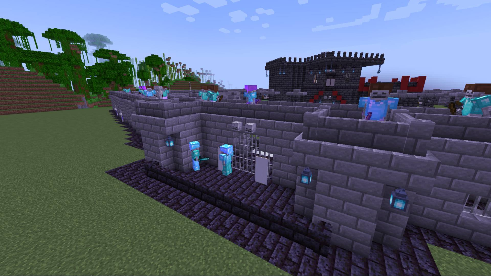
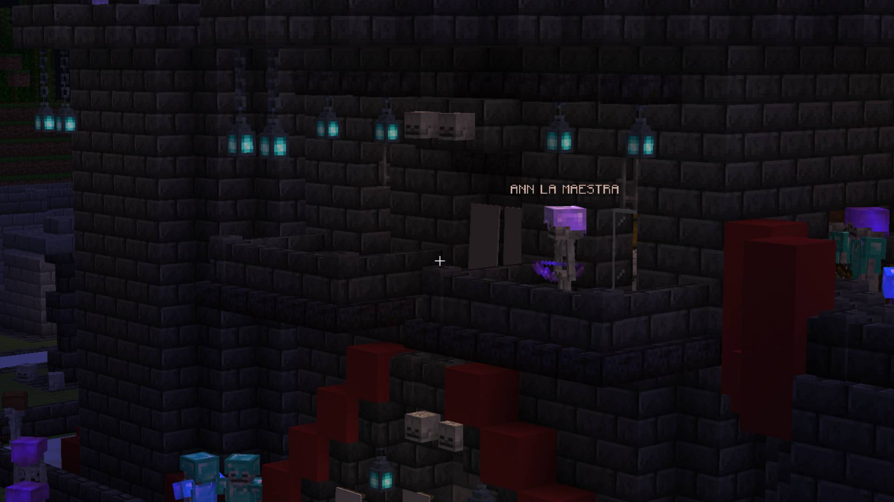
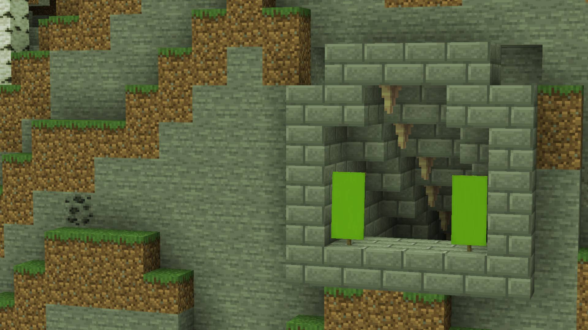
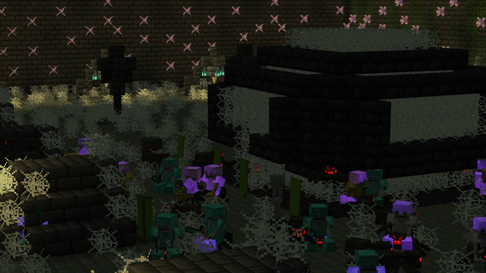
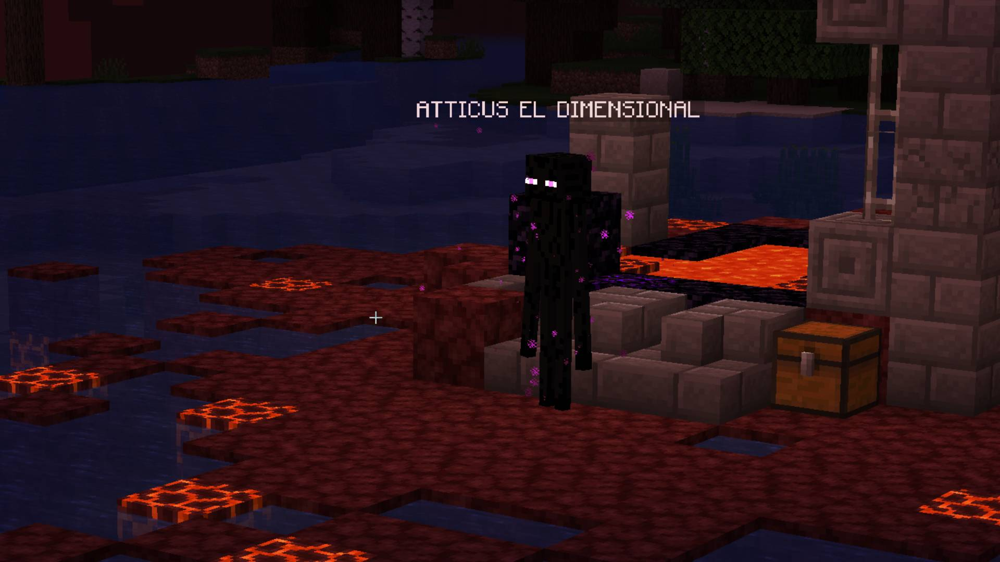
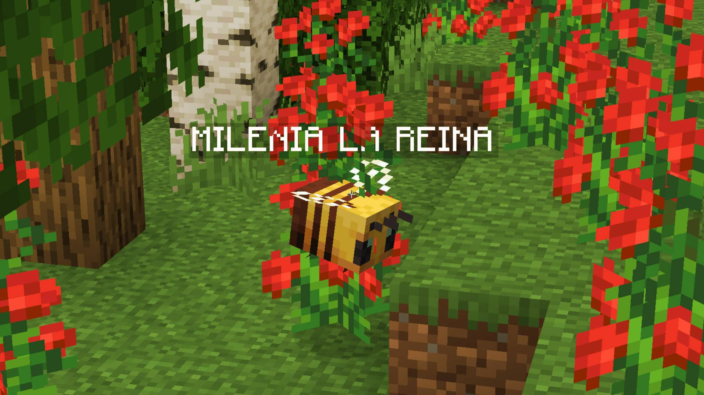
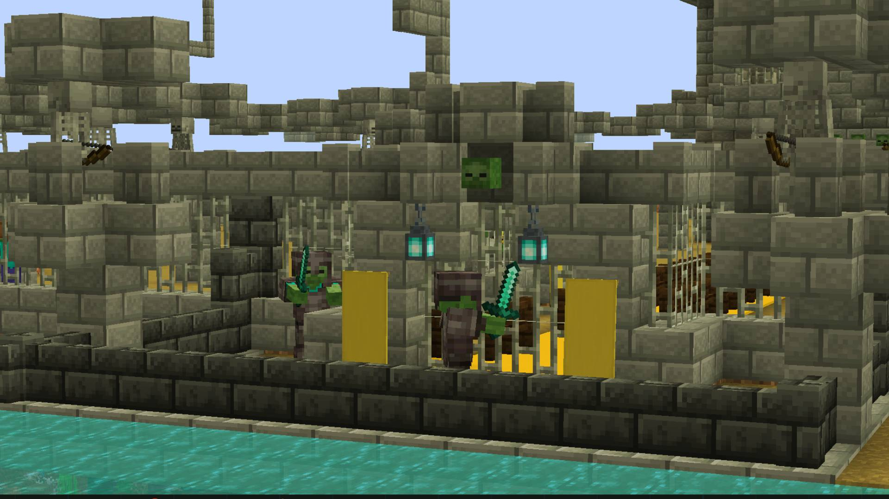
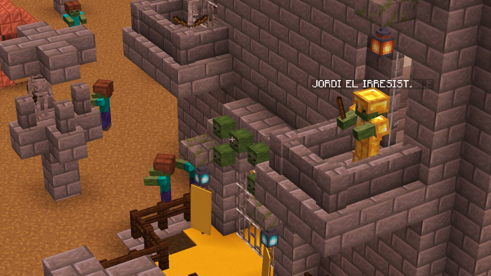
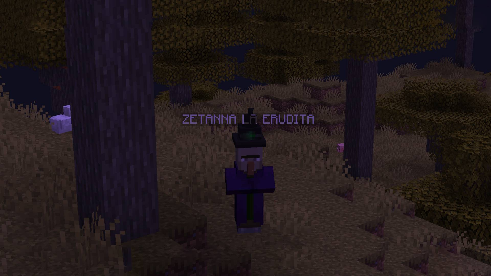

# Bosses Plugin

_BossesPlugin_ is a minecraft plugin that it increment the mobs difficulties in your world survivals.

## Actually bosses:

-  Master Creeper (master-creeper)
-  Master Skeleton (master-skeleton)
-  Support Zombie (support-zombie)
-  Soldier Spider (soldier-spider)
-  Queen Spider (queen-spider)
-  Master Wizard (master-wizard)
-  Expert Enderman (expert-enderman)
-  Queen Bee (queen-bee)

## Installation

Move this [file](./static/bosses-plugin.jar) to minecraft folder plugins.

## FEATURES V1.3
It's the v1.3 of **Bosses Plugin**, and it have a some updates

### Ann Tower

In this version the Ann tower is a tower where the Master Skeleton is located, this tower has multiple rewards but also is hard to defeat the tower.

#### Entry of Ann tower

#### Ann Castle

### Spider Base

The spider base is a base where the Queen spider and Soldier spider are located, it located inside on the caves, this base has a multiple rewards but is hard to defeat the base.

#### Entry of the Spider base

#### Center of the Spider Base

### New Boss: Expert Enderman

In this update we did add a boss that represents to the **Enderman** mob of minecraft.

### New Boss: Queen Bee

In this update we did add a boss that represents to the **Bee** mob of minecraft.

## FEATURES V1.2

It's the v1.2 of **Bosses Plugin**, and it have a some updates.

### Natural generation

The plugin create a tower where located **Support Zombie** boss naturally, is a castle that contains some rewards in many chests but it's to complicated to entry in the tower of the guards of the boss.

#### The entry of the tower:

#### Support Zombie boss in the tower:

### New Boss: Master Wizard

In this update we did add a boss that represents to the **Witch** mob of minecraft.

This boss has 2 passives and 2 ultimates.

### Commands

We have 4 new commands of this plugin. If you want to know how works, write in the console **/bsspl help**

This is a resume of the new commands:
- /bsspl save <name> <x-size> <y-size> <z-size> _Save a building by X, Y and Z size._
- /bsspl build <name> <angle = 0deg> _Build a structure by name that you save in X angle._
- /bsspl metadata-block <opts> _Set group of metadata._
- /bsspl clean-range <XSize> <Zsize> _Clean a range depending by X and Z size._

## Contributing

I'll apreciate all contributions, please send a pull request.

## License

[MIT](https://choosealicense.com/licenses/mit/)

💛💛💛 Learn not to grow old 💛💛💛

